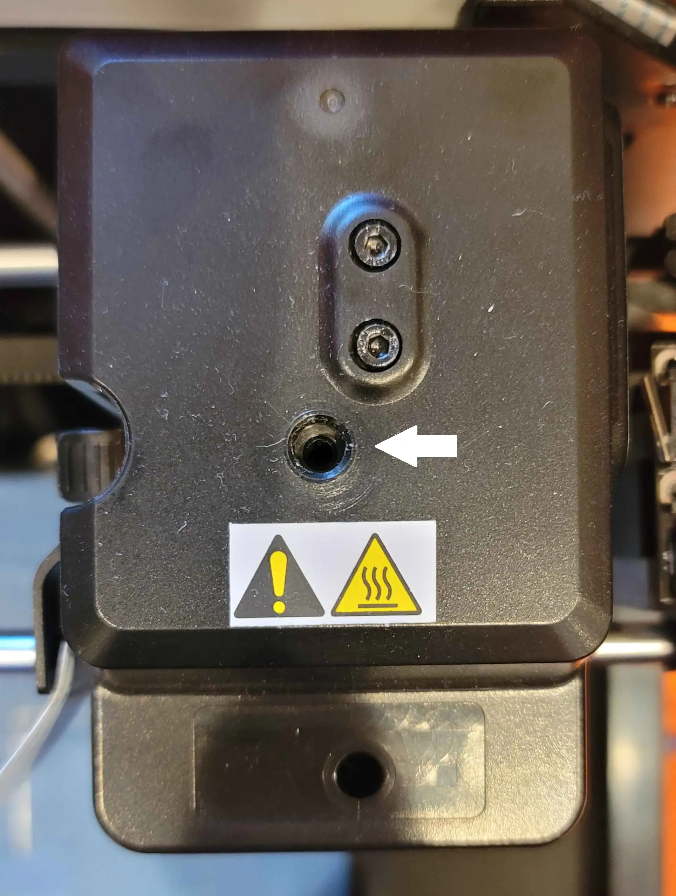
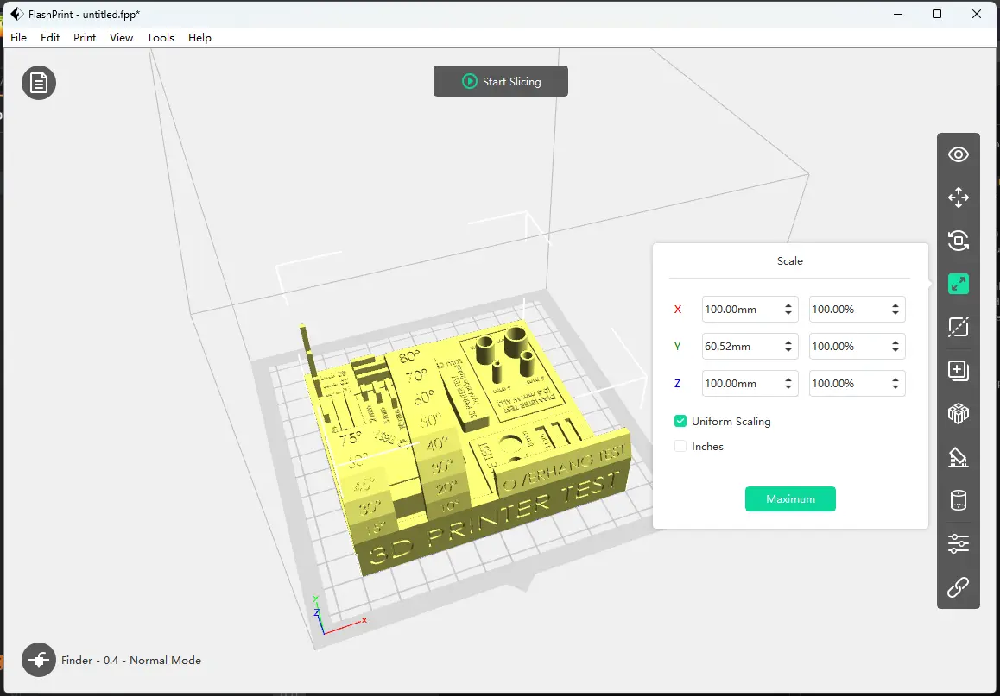
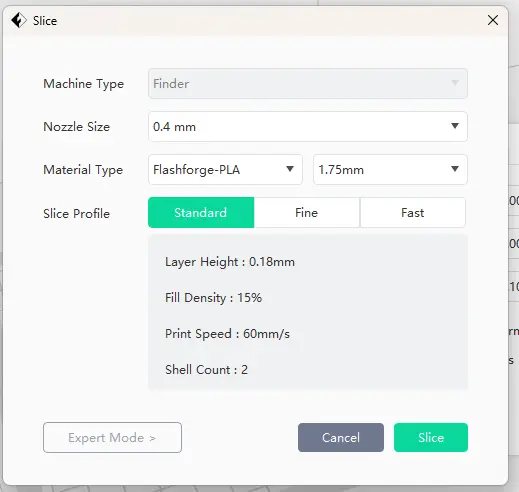
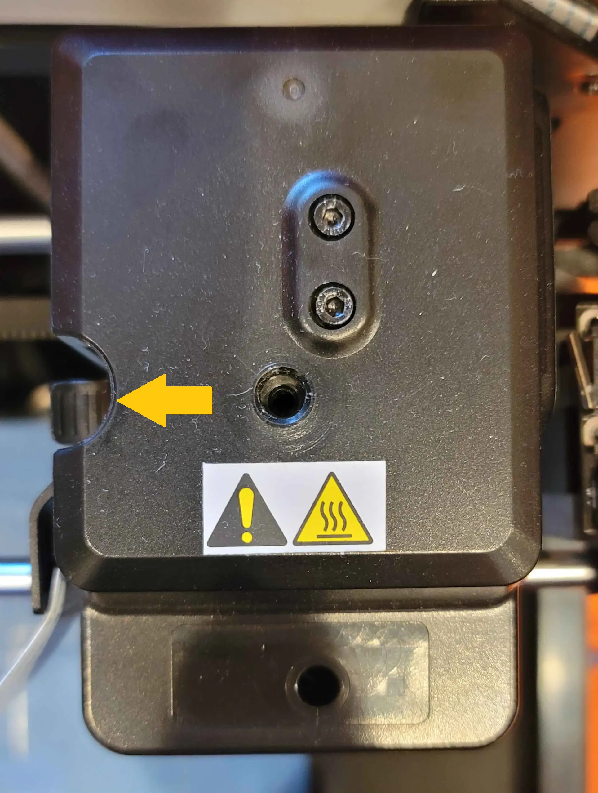

# 3D Printing

1. Turn on the 3D printing machine with the black square button.

2. From the main menu, press the **`Preheat`** button, then press **`Start`**. The default temperature should not be changed.

3. When the device reaches 100%, back out of the preheating function (green arrow button) and return to the main menu. Now, press the **`Tools`** button, then press **`Filament`**, then **`Load`**.

4. Slowly push the filament vertically into the top hole on the machine (pictured). Stop and press .**`Done`** when the filament comes out of the nozzle.

5. Open FlashPrint 5.

6. Connect the machine with **`Print > Connect Machine`**. The printer should automatically be detected by Automatic Scan. Click **`Connect All`**. Close out of the Multi-Machine Control that appears after.

7. Double-click the STL file you want to open.

8. The size of the model may be too big for the printer (or use too much filament). Use the **`Scale`** tool and adjust any coordinate (make sure **`Uniform Scaling`** is selected) to the desired size.

9.  Press **`Start Slicing`** to prepare the model for printing. A menu should open. Press **`Slice`** to confirm.

10. Send the code to the machine using the **`Send gCode`** button.

11. Monitor the filament as it is used by the printer. Because previous personnel unknowingly ruined the auto-loading function of the machine, you must feed extra filament to prevent breakages.

12. After the print is finished, be careful when unloading the print, as the nozzle will still be extremely hot.

13. Repeat steps 7-12 until all print jobs are complete.

14. When finished printing return to the **`Tools`** menu, then press **`Filament`**, then **`Unload`**. You may need to wait for the machine to heat up. Then, push down on the notch while pulling upwards on the filament.

