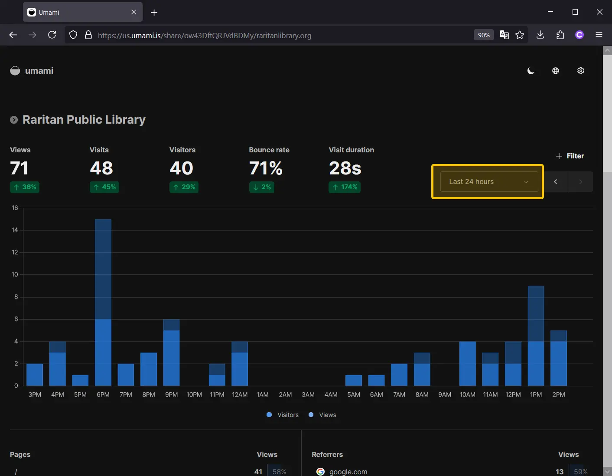
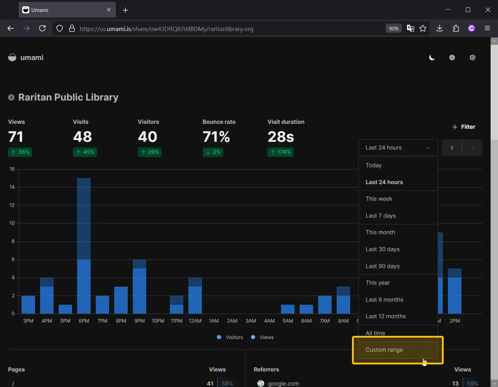
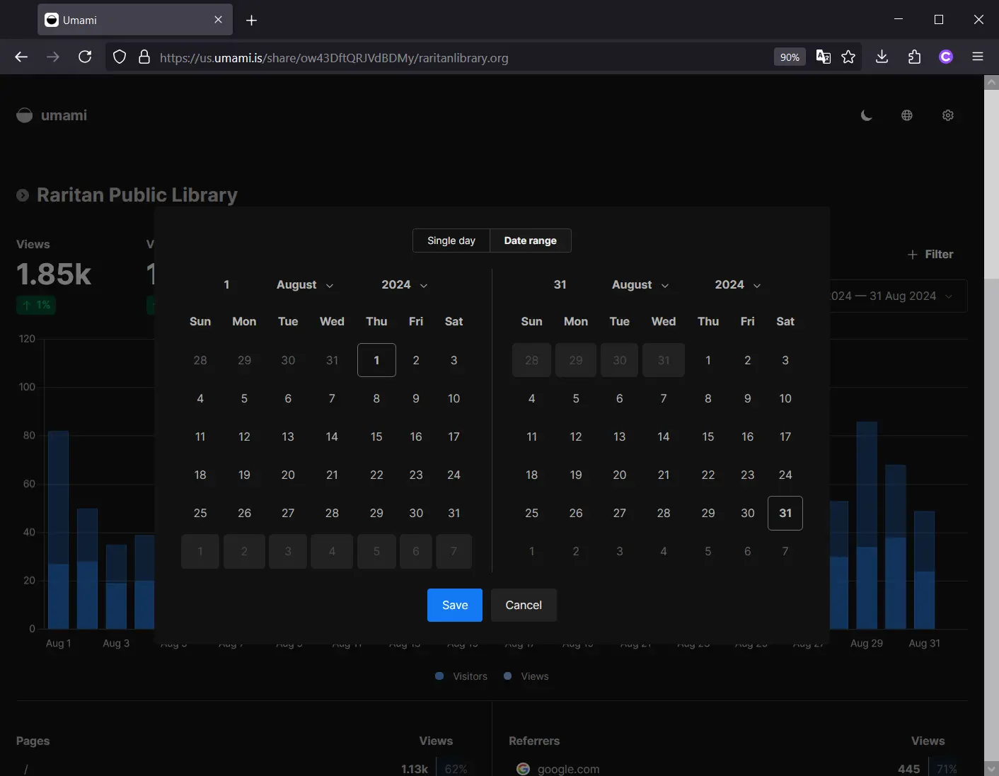
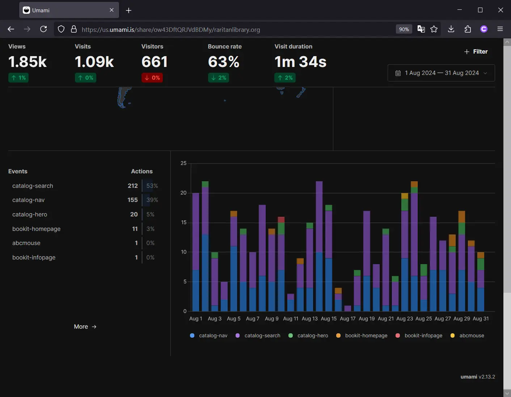
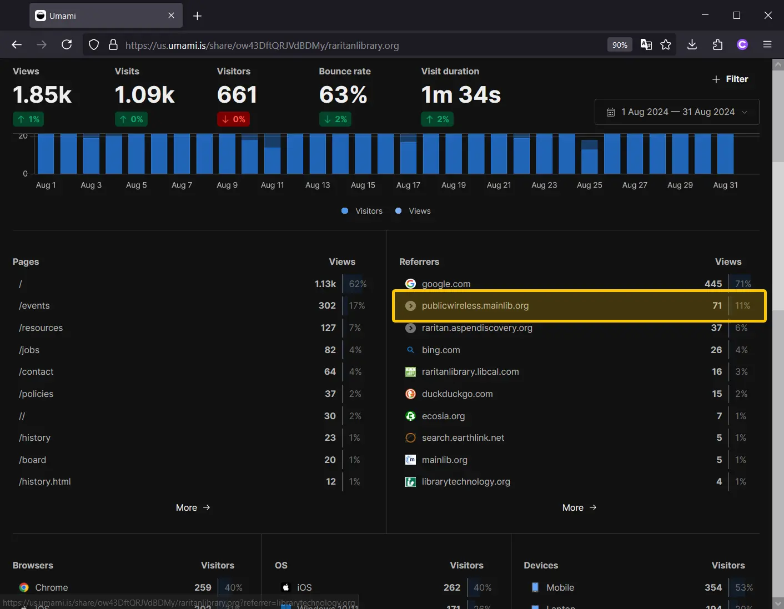

# Reporting Digital Statistics

Open [Umami](https://us.umami.is/share/ow43DftQRJVdBDMy/raritanlibrary.org).

Click **`Last 24 hours`** to activate the dropdown menu for selecting a date range.

Click **`Custom Range`** and select the date range for the month you want to view.

*Be sure to set the end date to the last day of the month/year and **NOT** the first of the current month.*

Press **`Save`** and the page will reload.

## Catalog Clicks, BookIt!, ABCMouse.com

Scroll to the bottom to the page to see a colored bar chart.

Under **`Events`**, you will be able to see certain type of clicked links activated on the website.

To get monthly totals:
- **Catalog Clicks** - Add the totals of any value that is prefixed with **`catalog-`**. Note that this is not the actual number of times the RPL Catalog has been accessed- only how many times people have been redirected to it from our website.
- **BookIt!** - Add the totals of any value that is prefixed with **`bookit-`**.
- **ABCMouse.com** - The number next to the **`abcmouse`** event. If it does not appear, assume the number of clicks was 0 for that month.

## Wi-Fi

> *Since the installation of the Main firewall, it isn't possible to get access to the exact number. This is an estimate calculated based on historical data.*

Near the middle of the website, see the section titled **`Referrers`**.

Take note of the number next to the entry for **`publicwireless.mainlib.org`**. If you add this with the number of sign-ins for computer use, and multiply this sum by 2, you can get an approximate number of Wi-Fi logins over the period of one month.